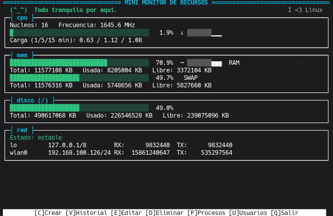

# Mini Monitor de Recursos Linux

Monitor de recursos del sistema para Linux con interfaz de terminal (TUI), desarrollado en Python 3 puro (sin dependencias externas) como Proyecto Integrador de la asignatura de Sistemas Operativos.

Permite visualizar en tiempo real el estado de CPU, Memoria, Disco, Red, Procesos y Usuarios, y llevar un historial de "capturas" del estado del sistema con operaciones CRUD completas y un sistema de etiquetas.



---

## Índice

- [Descripción general](#descripción-general)
- [Requisitos cumplidos](#requisitos-cumplidos)
- [Arquitectura del proyecto](#arquitectura-del-proyecto)
- [Instalación](#instalación)
- [Ejecución](#ejecución)
- [Controles de la interfaz](#controles-de-la-interfaz)
- [Base de datos](#base-de-datos)
- [Decisiones de diseño relevantes](#decisiones-de-diseño-relevantes)
- [Documentación adicional](#documentación-adicional)

---

## Descripción general

El **Mini Monitor de Recursos** es una aplicación de terminal que combina:

- **Lectura directa del sistema de archivos virtual `/proc`** para obtener métricas de CPU y memoria sin depender de librerías externas como `psutil`.
- **Ejecución de comandos Linux** (`df`, `ps`, `who`, `ip`, con respaldo en `loginctl`/`w`) vía `subprocess` para Disco, Procesos, Usuarios y Red.
- **Concurrencia real de Sistemas Operativos**: un proceso hijo creado con `os.fork()` que se comunica con el padre por `os.pipe()`, y dos hilos (`threading.Thread`) que actualizan métricas en tiempo real y detectan picos de tráfico de red.
- **Persistencia en SQLite** con operaciones CRUD completas y un sistema de etiquetas (tags) para clasificar cada captura.
- **Una TUI interactiva** construida con `curses` (biblioteca estándar), con paneles en cajas, barras de uso coloreadas, sparklines, listas con scroll, y una "carita" reactiva que refleja la salud general del sistema.

---

## Requisitos cumplidos

Cobertura completa de `ProyectoIntegradorSO.md` (ver también el detalle semana a semana en [`Planning.md`](Planning.md)):

### Módulos de monitoreo (Sección 4)

| Módulo       | Datos mostrados                                                  | Origen                                              |
| ------------ | ---------------------------------------------------------------- | --------------------------------------------------- |
| **CPU**      | Núcleos, frecuencia (MHz), % de uso, carga promedio (1/5/15 min) | `/proc/cpuinfo`, `/proc/loadavg`, `/proc/stat`      |
| **Memoria**  | Total, usada, libre, Swap (total/usada/libre)                    | `/proc/meminfo`                                     |
| **Procesos** | PID, nombre, estado, usuario propietario                         | `ps`                                                |
| **Usuarios** | Usuarios conectados, tiempo de conexión                          | `who` (con respaldo automático en `loginctl` / `w`) |
| **Disco**    | Espacio total, usado, libre                                      | `df`                                                |
| **Red**      | Interfaces, direcciones IP, tráfico (bytes RX/TX)                | `ip` + `/proc/net/dev`                              |

### Requisitos técnicos obligatorios (Sección 5)

- ✅ **Sistema de archivos `/proc`**: `/proc/cpuinfo`, `/proc/meminfo`, `/proc/loadavg`, `/proc/stat`, `/proc/net/dev`.
- ✅ **Procesos**: `os.fork()` en cada captura — el hijo ejecuta los comandos pesados (`df`, `ps`, `who`) y devuelve el resultado al padre por `os.pipe()`.
- ✅ **Hilos**: dos hilos concurrentes (`threading.Thread`) — Hilo A refresca CPU/RAM cada segundo, Hilo B detecta picos de tráfico de red.
- ✅ **Ejecución de comandos Linux**: `subprocess.run()` para `df`, `ps`, `who`, `ip`, `loginctl`, `w`.

### CRUD obligatorio (Sección 6)

- ✅ **Crear**: `[C]` registra una captura completa del estado del sistema (los 6 módulos) en SQLite.
- ✅ **Consultar**: `[V]` visualiza el historial, con filtro por etiqueta y detalle completo por captura (incluye Procesos/Usuarios congelados en ese momento).
- ✅ **Actualizar**: `[E]` modifica las etiquetas de una captura existente.
- ✅ **Eliminar**: `[D]` elimina una captura por ID.
- ✅ **Almacenamiento**: SQLite (`monitor.db`), sistema de etiquetas múltiples separadas por coma con valor por defecto `GENERAL`.

### Extras de originalidad

- TUI estilo `btop`: cajas con borde Unicode, barras de uso coloreadas por umbral, sparklines de historial reciente, flechas de tendencia, listas con scroll y barra de desplazamiento vertical.
- Carita ASCII reactiva y mensaje contextual según la salud global del sistema.
- Manejo de errores exhaustivo: timeouts en comandos externos, reintentos ante bloqueos de SQLite, degradación síncrona si `os.fork()` falla, y protección contra terminales demasiado pequeñas.

---

## Arquitectura del proyecto

```text
MiniMonitorRecursos/
│
├── README.md                   # Este archivo
├── ProyectoIntegradorSO.md      # Enunciado oficial del proyecto
├── Planning.md                  # Bitácora de decisiones de diseño y desarrollo
│
├── src/
│   ├── main.py                  # Orquestador: hilos, os.fork()/pipe, estado compartido
│   │
│   ├── core/
│   │   ├── proc_parser.py       # Lectura de /proc (CPU, memoria) — nunca lanza excepciones
│   │   └── cmd_runner.py        # Comandos externos (df, ps, who, ip) — timeouts y respaldos
│   │
│   ├── database/
│   │   └── db_manager.py        # SQLite: esquema, migraciones y CRUD con reintento
│   │
│   └── ui/
│       └── tui.py                # Interfaz interactiva con curses
│
├── docs/
│   ├── manual_instalacion.md
│   └── manual_ejecucion.md
│
├── requirements.txt              # Vacío a propósito: no hay dependencias externas
└── .gitignore
```

### Flujo de datos

```text
[ Usuario ]
    │
    v
[ TUI (curses) ] ──── lee ────> [ EstadoMonitor (hilos A/B) ] ──── /proc, subprocess ────> [ CPU / RAM / Disco / Red / Procesos / Usuarios ]
    │
    │ [C] Crear captura
    v
[ os.fork() + os.pipe() ] ──── comandos pesados en el hijo ────> [ padre combina y persiste ]
    │
    v
[ db_manager.py ] ──── CRUD parametrizado ────> [ SQLite: monitor.db ]
```

---

## Instalación

Ver también [`docs/manual_instalacion.md`](docs/manual_instalacion.md).

### Requisitos previos

- Linux (Ubuntu Desktop, Ubuntu Server o distribución equivalente).
- Python 3.10 o superior.
- Sin dependencias externas — solo la biblioteca estándar (`sqlite3`, `curses`, `subprocess`, `threading`, `os`).

### Pasos

```bash
git clone <url-del-repositorio>
cd MiniMonitorRecursos

python3 -m venv venv
source venv/bin/activate

pip install -r requirements.txt   # no instala nada: no hay dependencias

python3 -m src.database.db_manager   # inicializa monitor.db
```

---

## Ejecución

```bash
python3 -m src.main
```

Ver también [`docs/manual_ejecucion.md`](docs/manual_ejecucion.md) para el detalle completo de controles.

> **Nota:** la TUI requiere una terminal real (tty) — no funciona a través de un pipe o redirección. Usa una terminal gráfica normal (GNOME Terminal, Konsole, xterm, etc.) o una consola.

---

## Controles de la interfaz

| Tecla            | Acción                                                                                                              |
| ---------------- | ------------------------------------------------------------------------------------------------------------------- |
| `[C]`            | Crear una captura del estado actual del sistema (pide etiquetas).                                                   |
| `[V]`            | Ver historial de capturas (filtro por etiqueta, detalle completo por ID, incluye Procesos/Usuarios de ese momento). |
| `[E]`            | Editar las etiquetas de una captura (pide ID numérico + confirmación).                                              |
| `[D]`            | Eliminar una captura (pide ID numérico + confirmación).                                                             |
| `[P]`            | Ver la lista completa de procesos en vivo, con scroll.                                                              |
| `[U]`            | Ver usuarios conectados en vivo, con scroll.                                                                        |
| `[Q]` / `Ctrl+C` | Salir de la aplicación.                                                                                             |

Dentro de las listas con scroll (`[P]`, `[U]`, y las listas capturadas dentro del detalle de una captura): `↑`/`↓` mueve una fila, `RePág`/`AvPág` una página, `Inicio`/`Fin` salta a los extremos.

Los campos de **ID** solo aceptan dígitos mientras se escriben. **Eliminar** y **Editar** siempre piden confirmación de una sola tecla (`S` = sí) antes de aplicar el cambio.

---

## Base de datos

Tabla única `capturas` en SQLite (`monitor.db`, en la raíz del proyecto, excluida de git):

| Columna                             | Tipo                          | Descripción                                                                |
| ----------------------------------- | ----------------------------- | -------------------------------------------------------------------------- |
| `id`                                | INTEGER (PK, autoincremental) | Identificador de la captura.                                               |
| `fecha_hora`                        | TEXT                          | Marca de tiempo ISO de la captura.                                         |
| `cpu_uso`                           | REAL                          | % de uso de CPU en el momento de la captura.                               |
| `ram_total`, `ram_usada`            | INTEGER (KB)                  | Memoria RAM.                                                               |
| `disco_total`, `disco_usada`        | INTEGER (KB)                  | Espacio en disco (`/`).                                                    |
| `red_trafico_in`, `red_trafico_out` | INTEGER (bytes)               | Tráfico de red acumulado.                                                  |
| `procesos_json`                     | TEXT                          | Snapshot completo de procesos (PID/nombre/estado/usuario) en formato JSON. |
| `usuarios_json`                     | TEXT                          | Snapshot completo de usuarios conectados en formato JSON.                  |
| `etiquetas`                         | TEXT                          | Etiquetas separadas por coma (por defecto `GENERAL`).                      |

El esquema se migra automáticamente (`ALTER TABLE ... ADD COLUMN`) si se abre una base de datos creada con una versión anterior del proyecto, sin perder datos existentes.

---

## Decisiones de diseño relevantes

Resumen de las decisiones técnicas más importantes (detalle completo y justificación en [`Planning.md`](Planning.md)):

- **`os.fork()` acotado, no de toda la app**: el padre mantiene el control exclusivo de la TUI; el hijo solo ejecuta comandos pesados y termina con `os._exit()`. Evita corrupción de pantalla y problemas de `curses` con múltiples procesos sobre la misma terminal.
- **`os.fork()` en un proceso multihilo**: el hijo solo clona el hilo que invoca el fork — los Hilos A/B no existen en el hijo, que nunca toca el estado compartido ni sus locks.
- **% de CPU real vía `/proc/stat`**, no `/proc/loadavg` (que es _carga promedio_, no un porcentaje de uso).
- **Respaldo automático para `who`**: en sistemas con sesiones gestionadas por `systemd-logind` (Wayland, muchas distros modernas) `who` puede no reportar nada aunque haya un usuario conectado; se implementó una cadena de respaldo (`who` → `loginctl` → `w`).
- **Manejo de errores exhaustivo**: ninguna función de lectura de `/proc` lanza excepciones (devuelve valores por defecto), los comandos externos tienen `timeout` estricto, las escrituras a SQLite reintentan ante bloqueos, y `os.fork()` fallido degrada a captura síncrona en vez de crashear.
- **TUI responsiva**: el panel se adapta al tamaño real de la terminal en cada refresco; si no hay espacio, oculta secciones con un aviso en vez de romper el layout.

---

## Documentación adicional

- [`ProyectoIntegradorSO.md`](ProyectoIntegradorSO.md) — enunciado oficial del proyecto.
- [`Planning.md`](Planning.md) — plan de desarrollo semana a semana y bitácora de todas las decisiones de diseño, correcciones y mejoras aplicadas durante el proyecto.
- [`docs/manual_instalacion.md`](docs/manual_instalacion.md) — manual de instalación detallado.
- [`docs/manual_ejecucion.md`](docs/manual_ejecucion.md) — manual de ejecución y controles detallado.
